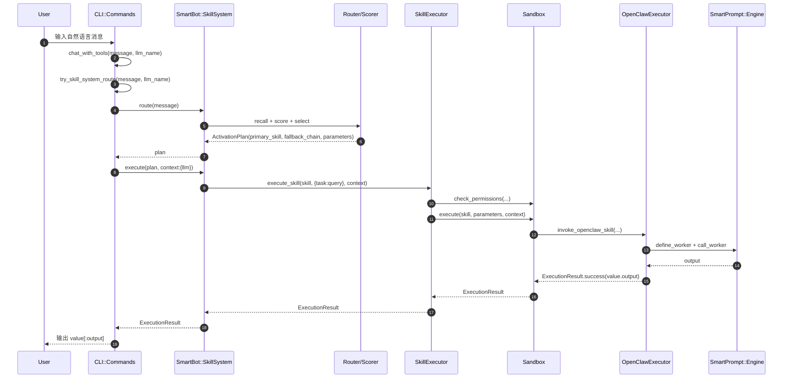
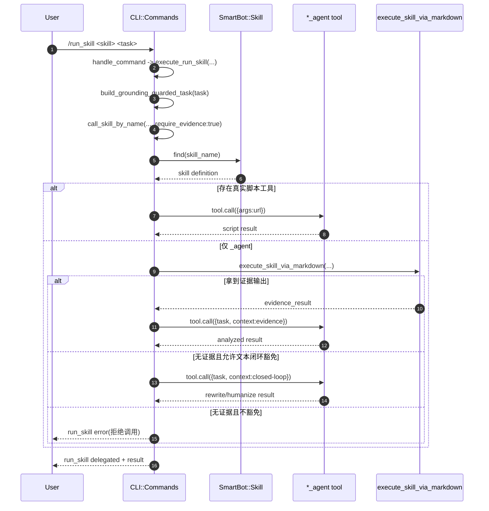
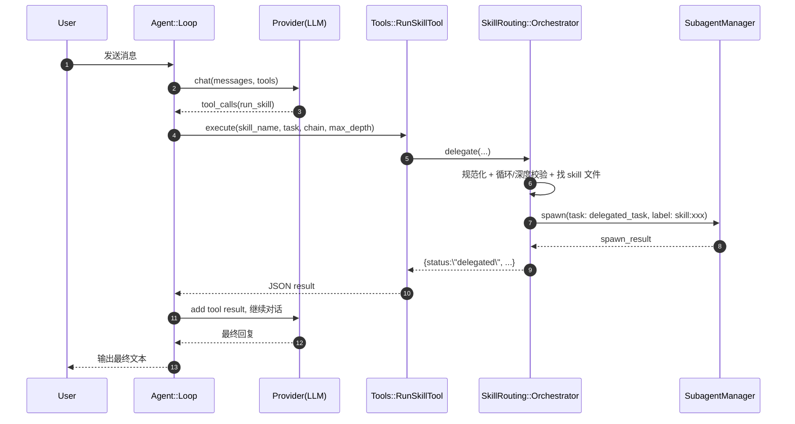
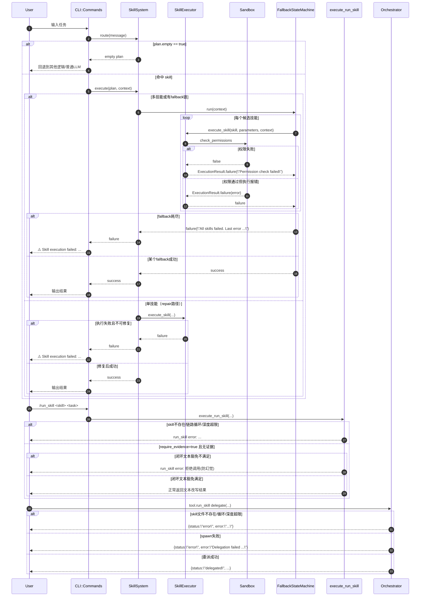

# SmartBot Agent Skill 执行全流程梳理

本文按代码真实路径梳理，从命令输入到最终输出，覆盖 3 条主链路：
1. CLI 自动 SkillSystem 路由（自然语言输入）
2. CLI 显式 `/run_skill` 委派（Legacy Skill 路径）
3. Agent Tool `run_skill`（子代理委派路径）

所有函数/参数均对应当前仓库代码。

## 1. 入口：命令行启动与输入接收

### 1.1 启动入口
- `bin/smart_bot:6`
- 调用：`SmartBot::CLI::Commands.start(ARGV)`

### 1.2 `agent` 命令初始化
- `lib/smart_bot/cli/commands.rb:19`
- 函数：`SmartBot::CLI::Commands#agent`
- 关键动作：
  1. 初始化 `SmartAgent::Engine`（`@agent_engine`）
  2. 加载 legacy skill 系统：`load_skill_system`
  3. 加载并激活 skill：`load_and_activate_skills`
  4. 加载新 SkillSystem：`load_new_skill_system`

### 1.3 用户输入进入主对话函数
- 单次 `-m` 输入：`chat_with_tools(message, current_llm)`（`commands.rb:56`）
- 交互输入：`chat_with_conversation(...)` 内也会先走 skill 路径（同文件）

---

## 2. 路径 A：自然语言输入 -> SkillSystem 自动路由

### 2.1 入口函数与顺序
- `lib/smart_bot/cli/commands.rb:198`
- 函数：`chat_with_tools(message, llm_name)`
- 顺序：
  1. `try_skill_system_route(message, llm_name)`（优先）
  2. 若返回 `nil`，再尝试显式 `run_skill` 语法

### 2.2 `try_skill_system_route` 调用细节
- `lib/smart_bot/cli/commands.rb:1206`
- 输入参数：
  - `message`（原始用户文本）
  - `llm_name`（当前模型）
- 执行：
  1. `plan = SmartBot::SkillSystem.route(message)`（`commands.rb:1211`）
  2. 若 `plan.empty?` -> 返回 `nil`
  3. 否则取 `primary_skill = plan.primary_skill`
  4. 调用 `SmartBot::SkillSystem.execute(plan, context: { llm: llm_name })`（`commands.rb:1221`）

### 2.3 SkillSystem 路由阶段

#### 2.3.1 加载与注册
- `lib/smart_bot/skill_system.rb:60`
- `SmartBot::SkillSystem.load_all`
  - `UnifiedLoader.load_all` 发现 skill 目录并加载（`core/loader.rb:32`）
  - 注册到 `SkillRegistry`

#### 2.3.2 Skill 文件类型判定
- `lib/smart_bot/skill_system/core/loader.rb:72`
- `load_from_path(path)` 顺序：
  1. `skill.rb` -> `:ruby_native`
  2. `skill.yaml + SKILL.md` -> 结构化 skill
  3. `SKILL.md` frontmatter -> `:openclaw_instruction`
     - 注意：当前实现里普通 frontmatter 也走 OpenClaw 兼容加载（`loader.rb:151-170`）

#### 2.3.3 Router 召回与打分
- `lib/smart_bot/skill_system/routing/router.rb:37`
- `Router#route(query:, context:, history:, stats:)`
- 召回三类候选（`router.rb:67-73`）：
  1. `hard_trigger_candidates`：`$skill`、`run_skill xxx` 等强触发
  2. `rule_based_candidates`：`registry.find_by_trigger(query)`
  3. `semantic_candidates`：语义索引召回
- 打分：`score_candidates` -> `SkillScorer#score`（`router.rb:126`, `scorer.rb:25`）

#### 2.3.4 评分因子（权重）
- `lib/smart_bot/skill_system/routing/scorer.rb:16`
- 指标：
  - `intent_match`（0.40）
  - `trigger_match`（0.20）
  - `success_rate`（0.15）
  - `context_readiness`（0.10）
  - `cost_penalty`（0.10）
  - `conflict_penalty`（0.05）
- 额外行为：
  - 检测意图关键词（下载/总结/搜索等，`scorer.rb:8-14`）
  - 若描述含否定意图（如 not for downloading）会扣分（`scorer.rb:163-179`）

#### 2.3.5 生成 ActivationPlan
- `router.rb:152`
- `ActivationPlan` 核心字段（`routing/activation_plan.rb`）：
  - `skills`
  - `parameters`（这里是 `{ task: query }`）
  - `primary_skill`
  - `fallback_chain`
  - `parallel_groups`

### 2.4 SkillSystem 执行阶段

#### 2.4.1 execute 入口
- `lib/smart_bot/skill_system.rb:76`
- `SmartBot::SkillSystem.execute(plan, context:, enable_repair: true)`
- 分支：
  1. 有 fallback/并行组 -> `FallbackStateMachine.run`（`fallback.rb:27`）
  2. 单技能且启用 repair -> `RepairLoop.execute_with_repair`（`repair_loop.rb:24`）
  3. 否则 -> `SkillExecutor.execute`

#### 2.4.2 单技能执行
- `lib/smart_bot/skill_system/execution/executor.rb:28`
- `execute_skill(skill, parameters, context)`
  1. `@sandbox.check_permissions(skill.metadata.permissions, skill.type)`
  2. `@sandbox.execute(skill, parameters, context)`
  3. 返回 `ExecutionResult.success/failure`

#### 2.4.3 Sandbox 内部按 skill.type 分发
- `lib/smart_bot/skill_system/execution/sandbox.rb:82`
- 类型分支：
  - `:ruby_native` -> `invoke_ruby_skill`
  - `:instruction` -> `invoke_instruction_skill`
  - `:script` -> `invoke_script_skill`
  - `:openclaw_instruction` -> `invoke_openclaw_skill`（调用 `Execution::OpenClawExecutor.new.execute`）

#### 2.4.4 OpenClawExecutor 执行（当前主路径）
- `lib/smart_bot/skill_system/execution/openclaw_executor.rb:31`
- `execute(skill, parameters, context)`：
  1. `extract_task(parameters)` 取 `:task`
  2. 读取 frontmatter 元信息
  3. 若命中 YouTube summarizer 特例 -> `execute_youtube_summarizer`（`openclaw_executor.rb:272`）
  4. 否则构造 `system_prompt + user_prompt` 后 `execute_via_llm`
  5. 返回 `ExecutionResult.success(value: { success, output, execution_time, worker_name })`

#### 2.4.5 CLI 如何产出最终展示文本
- `lib/smart_bot/cli/commands.rb:1223-1232`
- 若 `result.success?`：
  - `value` 是 Hash 且有 `:output` -> 输出 `value[:output]`
  - 否则 `value.to_s`
- 若失败：打印 `⚠️ Skill execution failed: ...` 并返回 `nil`

---

## 3. 路径 B：显式 `/run_skill`（CLI 内建委派）

### 3.1 命令解析入口
- `/run_skill ...` 在 `handle_command` 分支处理：`commands.rb:1917-1927`
- 直接调用：`execute_run_skill(skill_name:, task:, llm_name:)`

### 3.2 `execute_run_skill` 执行链
- `lib/smart_bot/cli/commands.rb:656`
- 参数：
  - `skill_name`：目标技能名
  - `task`：用户任务文本
  - `llm_name`
  - 可选：`parent_skill`, `chain`, `max_depth`
- 关键判断：
  1. 技能名/任务非空校验
  2. 委派链路循环检测、深度限制（默认 2）
  3. `SmartBot::Skill.find(...)` 确认 skill 存在
  4. 给 task 注入防幻觉要求：`build_grounding_guarded_task`（`commands.rb:980`）
  5. 调用 `call_skill_by_name(..., require_evidence: true)`

### 3.3 `call_skill_by_name` 如何决定执行方式
- `lib/smart_bot/cli/commands.rb:1516`
- 分支：
  1. 若发现真实脚本工具（`scripts/` 有同名脚本）
     - 调用 `SmartAgent::Tool.find_tool(tool_name)`
     - 入参 `{"args" => url}`
  2. 否则找 `_agent` 工具
     - 先尝试 `execute_skill_via_markdown(...)` 抽取并执行 SKILL.md 中命令获取证据
     - 若拿到证据，拼到 `context` 再调用 `_agent`
     - 若 `require_evidence=true` 且无证据：
       - 纯文本闭环任务可豁免（`allow_text_only_agent_without_evidence?`, `commands.rb:1032`）
       - 否则拒绝，返回“为避免幻觉已拒绝调用”

### 3.4 `/run_skill` 输出如何生成
- `execute_run_skill` 最后返回文本块（`commands.rb:717-723`）：
  - `run_skill delegated: <skill>`
  - `chain: ...`
  - skill 返回正文
- 若失败，返回 `run_skill error: ...`

---

## 4. 路径 C：Agent Tool `run_skill`（子代理委派）

这条路径不是 CLI `/run_skill`，而是 LLM 在 Agent Loop 里发起工具调用。

### 4.1 工具注册
- `lib/smart_bot/agent/loop.rb:55-56`
- 注册 `Tools::RunSkillTool.new(@skill_orchestrator)`

### 4.2 工具调用触发
- `Agent::Loop#process_message`（`agent/loop.rb:99`）
- Provider 返回 tool calls 后执行：`@tools.execute(tool_call.name, tool_call.arguments)`（`loop.rb:149-152`）
- 若工具名是 `run_skill`，进入 `RunSkillTool#execute`

### 4.3 `RunSkillTool#execute`
- `lib/smart_bot/tools/run_skill.rb:52`
- 直接调用 orchestrator：
  - `@orchestrator.delegate(skill_name:, task:, parent_skill:, chain:, max_depth:, origin_channel:, origin_chat_id:)`
- 返回 JSON 字符串

### 4.4 `SkillRouting::Orchestrator#delegate`
- `lib/smart_bot/skill_routing/orchestrator.rb:19`
- 逻辑：
  1. 规范化 skill 名与参数校验
  2. 循环/深度保护
  3. 查找 `SKILL.md` 文件路径
  4. 构造 delegated task 模板
  5. `@subagent_manager.spawn(...)` 启动子代理执行
- 返回：
  - 成功：`{ status: "delegated", skill, chain, ... }`
  - 失败：`{ status: "error", error: "..." }`

---

## 5. 输入参数与数据结构速查

### 5.1 SkillSystem 路由调用
- 调用点：`SmartBot::SkillSystem.route(message)`
- 输入：`query: String`
- 输出：`ActivationPlan`
  - `parameters` 当前为 `{ task: query }`

### 5.2 SkillSystem 执行调用
- 调用点：`SmartBot::SkillSystem.execute(plan, context: { llm: llm_name })`
- 输出：`ExecutionResult`
  - `success?`：是否成功
  - `value`：成功结果（常见含 `output`）
  - `error`：失败原因
  - `metadata`：执行元信息

### 5.3 Legacy Skill 调用
- 调用点：`call_skill_by_name(skill_name, message, urls, llm_name, require_evidence:)`
- 可能传给 tool 的参数：
  - 脚本工具：`{"args" => url}`
  - `_agent` 工具：`{"task" => message, "context" => context}`

---

## 6. 关键判断点总结（你最常看到的行为来源）

1. 为什么会先走 SkillSystem？
- `chat_with_tools` 里 `try_skill_system_route` 在最前（`commands.rb:203-205`）。

2. 为什么显示 `Primary skill: ...`？
- `try_skill_system_route` 中打印 plan 主技能（`commands.rb:1215-1219`）。

3. 为什么会出现 “All skills failed. Last error ...”？
- `FallbackStateMachine` fallback 全部耗尽时返回该错误（`fallback.rb:93-96`）。

4. 为什么 `/run_skill` 有时拒绝执行？
- `require_evidence: true` 且 `_agent` 无可执行证据流程时会拒绝（`commands.rb:1619-1633`）。

5. 为什么 `humanizer` 现在可以在 `/run_skill` 下执行？
- 命中闭环文本豁免：`allow_text_only_agent_without_evidence?`（`commands.rb:1032`）。

---

## 7. 实战示例（参数流）

### 示例 A：`下载YouTube视频：https://...`
1. `chat_with_tools(message, llm)`
2. `try_skill_system_route(message, llm)`
3. `SmartBot::SkillSystem.route(message)` -> `ActivationPlan(primary_skill: youtube_downloader)`
4. `SmartBot::SkillSystem.execute(plan, context: { llm: llm })`
5. `SkillExecutor#execute_skill(skill, { task: message }, { llm: llm })`
6. `Sandbox#invoke_skill` 按 `skill.type` 分发执行
7. 返回 `ExecutionResult.value[:output]` -> CLI 输出

### 示例 B：`/run_skill humanizer <一段文本>`
1. `handle_command` -> `execute_run_skill(skill_name: "humanizer", task: "...", llm_name: "...")`
2. 注入 grounding 约束
3. `call_skill_by_name(..., require_evidence: true)`
4. `_agent` 无证据命令 -> 检查 `allow_text_only_agent_without_evidence?`
5. 命中豁免 -> 直接调用 `humanizer_agent(task, context)`
6. 返回文本改写结果

---

## 8. 当前架构中的两套 Skill 执行体系（避免混淆）

1. 新体系：`SmartBot::SkillSystem`（路由 + 执行器 + Sandbox + OpenClaw）
2. 旧体系：`SmartBot::Skill` + `call_skill_by_name`（`/run_skill` 主要仍走这条）

这就是你会看到“同是 skill 调用，但日志和行为略有不同”的根本原因。

---

## 9. 时序图（Mermaid）

### 9.1 自动 SkillSystem 路由（自然语言输入）

### 9.2 显式 `/run_skill`（CLI Legacy Skill 路径）

### 9.3 Agent Tool `run_skill`（子代理委派）

### 9.4 失败分支专用图（排障视角）

